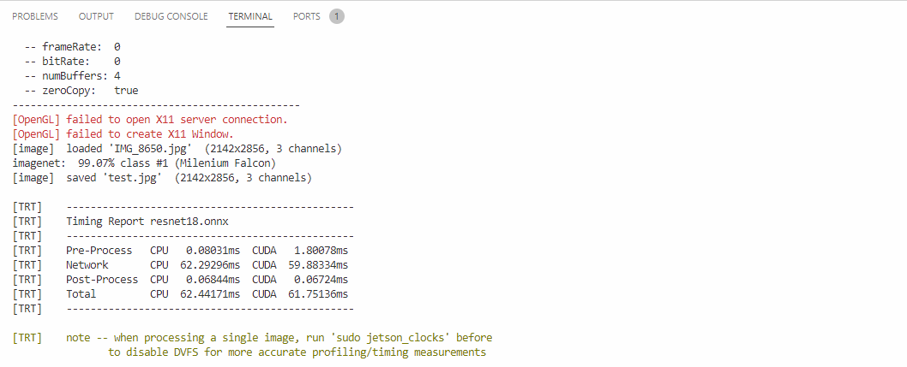

# Lego Set Classification

This is a program that uses image classification to allow the user to easily classify lego sets.

## The Algorithm

The algorithm uses transfer learning to apply a new dataset to Resnet18 to scan and classify lego sets. Image Classification is a algorithm that runs through an image and determines what parts it can identify, then idenifies what type it is. 
## Running this project

1. Download the project from Github.
2. install the jetson-inference library.
3. cd my_project
4. imagenet.py --model=resnet18.onnx --input_blob=input_0 --output_blob=output_0 --labels=labels.txt IMG_8650.jpg test.jpg

[View a video explanation here](https://drive.google.com/file/d/1vR59EQPpnJcnei-k9nCD1F22tS7speCc/view?usp=sharing)